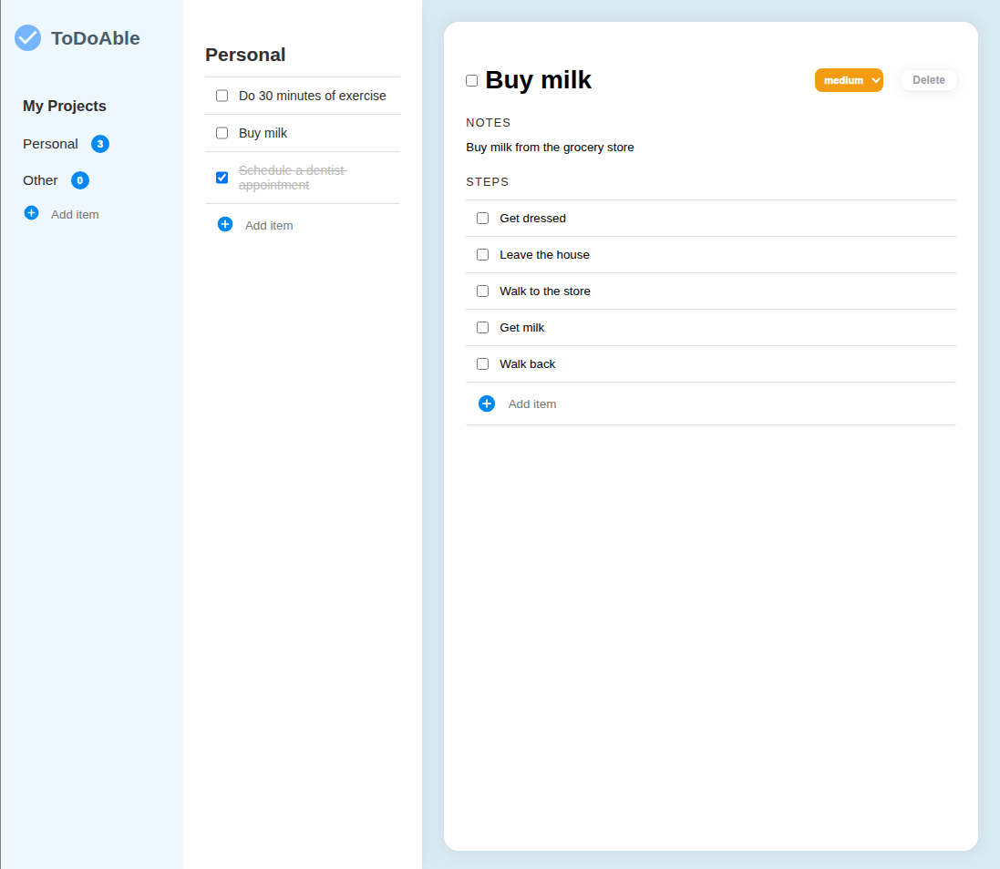
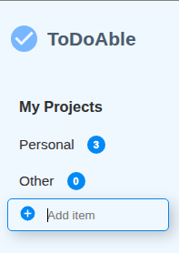
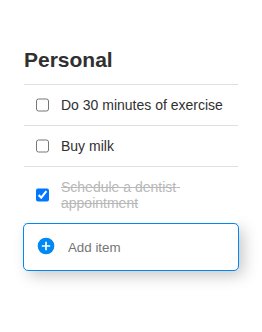
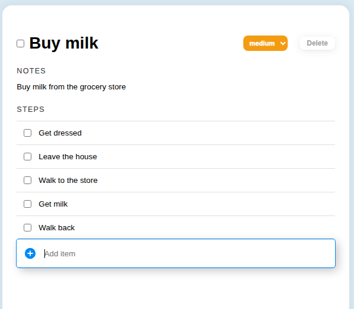

# ToDo Web Application

A todo list application built with vanilla JavaScript. Organize tasks into projects, set priorities, break down complex tasks into steps, and automatically save everything to local storage.

**➤ Try it out:** 

## Technologies Used

* Javascript
* HTML/CSS
* Webpack
* `autosize` package
* Local storage (for data persistence)

## Features

### Projects

The sidebar view contains a list of projects with their own todos. A new project can be added and populated with items.

### Todo List

Project view shows a list of all todos associated with the project. Selecting a todo will open an extended editable view in a side panel. 

A new todo can be added and the newly created item will be opened to the side for further edits.

### Todo View

Each Todo contains:
- Name
- Priority
- Description (Notes)
- Steps (a list of subtasks)

Each field is editable and is saved to local storage.

## Future goals and todos

* Convert to a modern frontend framework
* Create a backend component instead of using Local Storage
* Add a way to delete and rename projects
* Add due dates for todos
* Make the layout compatible with mobile platforms
